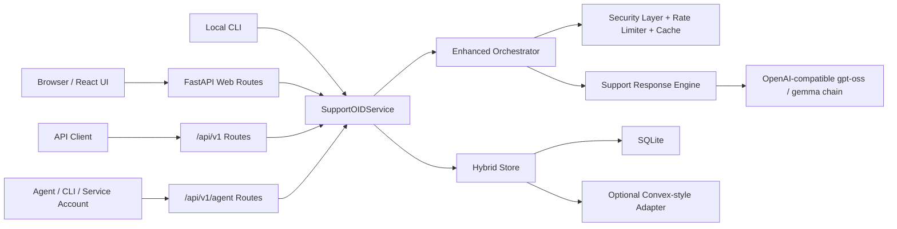

# Architecture

SupportOID is organized around one canonical backend service that is shared by the web UI, REST API, CLI, and agent automation surface.

## High-level view

## Main layers

### Interface layer

- `src/interface/web_routes.py`
  Browser routes and SPA fallback
- `src/api/routes.py`
  Main human-facing API under `/api/v1`
- `src/api/agent_routes.py`
  Service-account automation API under `/api/v1/agent`
- `src/cli/__main__.py`
  Local CLI and bootstrap commands

### Application layer

- `src/app/service.py`
  Canonical application service for chat, feedback, traces, health, stats, sync, and migration
- `src/app/auth.py`
  Persistent auth, session cookies, RBAC, and service-account token handling
- `src/app/dto.py`
  Shared request and response contracts
- `src/app/automation.py`
  Agent capability registry, approvals, idempotency, and job envelopes

### Orchestration layer

- `src/agents/enhanced_orchestrator.py`
  Guardrails, caching, concurrency controls, and output checks
- `src/orchestrator.py`
  Core support flow: classify, retrieve, generate, score, escalate, persist
- `src/agents/support_response.py`
  Structured support answer generation and fallback behavior

### Persistence layer

- `src/app/storage.py`
  SQLite trace, feedback, cost, conversation, and sync queue persistence
- `src/app/automation_store.py`
  Users, sessions, service accounts, approvals, jobs, and audit events
- `convex-adapter/src/index.ts`
  Optional adapter bridge for demo/self-host sync

## Request flow

1. The user authenticates with a session cookie or a service account bearer token.
2. The request enters the FastAPI route layer.
3. RBAC and request validation run before the core service call.
4. The enhanced orchestrator checks high-risk input patterns and rate limits.
5. The support pipeline classifies intent, retrieves KB context, and generates a structured response or safe fallback.
6. Output validation runs before the response is returned.
7. Redacted traces, feedback, sessions, and automation audit records are persisted to SQLite.
8. Optional sync events are queued for the adapter bridge.

## Auth architecture

- Human auth uses session cookies stored in SQLite-backed session rows.
- Service-account auth uses bearer tokens hashed in SQLite.
- Roles:
  - `support`
  - `analyst`
  - `admin`
- Legacy `/api/*` aliases are still present for compatibility but require authentication.

## Storage and retention

SQLite is the canonical local persistence layer for:

- Users
- Sessions
- Service accounts
- Conversation traces
- Feedback records
- Conversation turns
- Cost summaries
- Sync queue events
- Automation approvals, jobs, and audit events

Retention defaults:

- Traces: 30 days
- Feedback: 90 days

## Frontend and backend relationship

- The React frontend is built separately in `frontend/`.
- The backend can serve the built SPA from `frontend/dist`.
- During development, the frontend typically runs on `http://localhost:5173` and talks to the FastAPI backend on `http://localhost:8001`.

## Release posture

- Public source releases should keep generated runtime data out of Git.
- Sanitized KB examples live under `data/seed/knowledge`.
- Runtime bootstrap happens through CLI commands, not shipped credentials.
